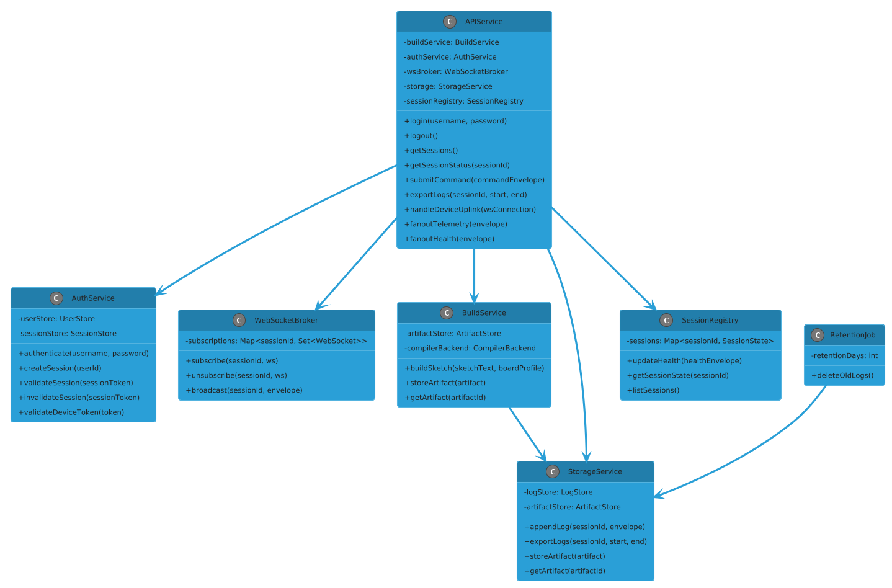
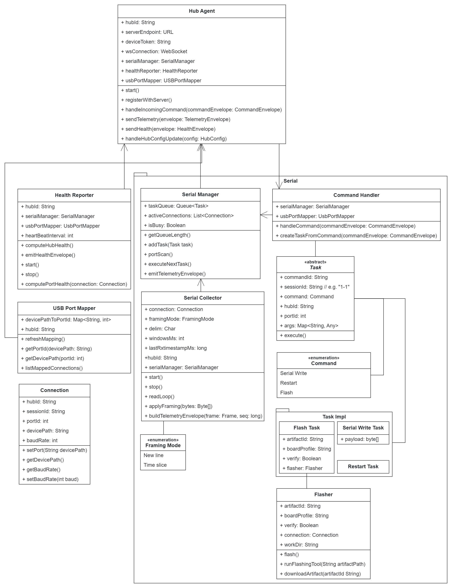
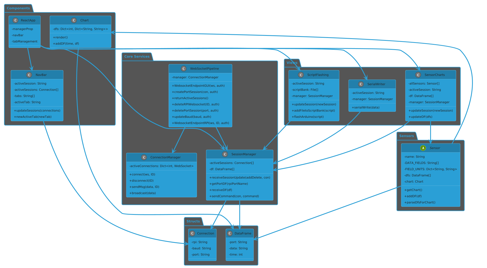
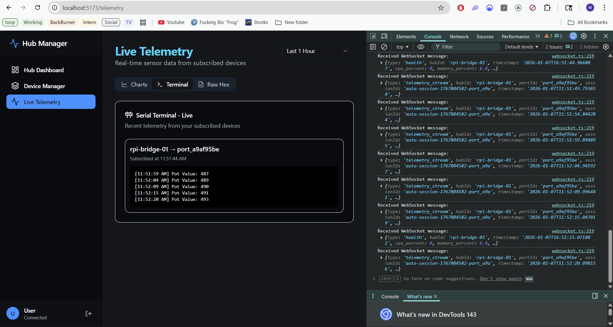
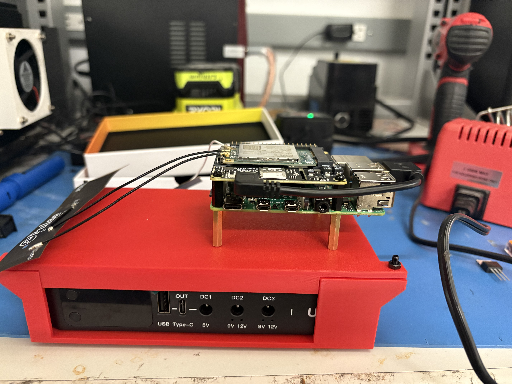

<!-- Top-level project README for electrical-gui -->
# electrical-gui

[](https://gui.cornellhyperloop.com/)


A modular suite for hub management, telemetry, and a modern web GUI for Hyperloop team operations. This repository contains the cloud services, Raspberry Pi hub server, web client, and related utilities used to run, test, and develop the system.

**Quick links**
- Cloud API: [cloud-services](cloud-services)
- Hub agent & server: [rpi-hub-server](rpi-hub-server)
- Browser UI: [web-client](web-client)
- Fallback relay: [wifi-fallback-relay](wifi-fallback-relay)

Anyone is welcome to view the live GUI at: https://gui.cornellhyperloop.com/

**Repository layout**
- `cloud-services/` — FastAPI backend for authentication, websockets, hub coordination, and telemetry storage.
- `rpi-hub-server/` — Edge service that runs on Raspberry Pi devices: serial/USB management, hardware command tasks, and a lightweight FastAPI/WS endpoint.
- `web-client/` — React + TypeScript single-page app (Vite) for live telemetry, device control, and charting.
- `wifi-fallback-relay/` — Small Python-based relay service for network fallback scenarios.

## Architecture

The system is split into three primary tiers:

- Cloud / API: central FastAPI application exposing REST endpoints and WebSocket hubs for realtime telemetry and command routing.
- Edge / Hub: Raspberry Pi agent that manages local serial devices, performs device tasks, and streams telemetry back to the cloud.
- Client: A TypeScript React app (Vite) that connects to the cloud WebSocket endpoints for realtime dashboards and control.







A short video of the GUI being used to operate our team's minipod is attached [here](res/readme/loophyper.mp4).

## Technical specifics

- Backend: `FastAPI` (>=0.115.0) + `uvicorn` for ASGI serving. WebSocket hubs use the `websockets` package and integrate with Pydantic models for typed messages.
- Auth: JWT-based tokens (see `cloud-services/src/api/auth.py`) with password hashing via `passlib[bcrypt]`.
- Data models: `pydantic` / `pydantic-settings` for config and runtime validation.
- Edge: `pyserial` for hardware serial connections, `psutil` for health metrics, configurable tasks and reconnect logic in `rpi-hub-server/src/tasks/`.
- Frontend: React 19 + TypeScript, built with Vite; key libs include `recharts` for charts and `zustand` for state.

## Local development

Prerequisites: Python 3.11+, Node 18+ (or matching versions used by your environment), Git.

Backend (example)

1. Create and activate a Python virtual environment in `cloud-services`:

```powershell
python -m venv .venv
.\.venv\Scripts\Activate.ps1
pip install -r requirements.txt
```

2. Run the cloud API locally (development):

```powershell
cd cloud-services
set ENV_FILE=.env.development
python -m uvicorn src.main:app --reload --host 0.0.0.0 --port 8000
```

Frontend

```bash
cd web-client
npm install
npm run dev
```

Edge / RPi

1. Install dependencies on the target device or in a venv under `rpi-hub-server` and configure `config/config.yaml` as needed.
2. Start the hub agent with: `python -m src.main` (or use the provided systemd units in `systemd/` for production).
3. (Optional) If no physical Raspberry Pis are avaliable there is a `mock_hub_simulator.py` script at [/tests](rpi-hub-server/tests/mock_hub_simulator.py)

## Tests & CI

- Python: `pytest` and `pytest-asyncio` are used across services. See tests in each service folder (e.g., `cloud-services/tests` and `rpi-hub-server/tests`).
- Frontend: TypeScript type checks and ESLint are enforced in `web-client` (see `package.json` scripts).

## Assets and visuals

Project visuals and diagrams used above live in `res/readme/`:

- 
- 
- [res/readme/cloud_service_diagram.png](res/readme/cloud_service_diagram.png)
- [res/readme/rpi_hub_diagram.png](res/readme/rpi_hub_diagram.png)
- [res/readme/gui_diagram.png](res/readme/gui_diagram.png)

## License

This project is licensed under the MIT License — see [LICENSE.md](LICENSE.md) for details.

